# Trabalho Prático 3: Gerenciador de Academia com back-end

Este projeto é a implementação de um sistema full-stack para o gerenciamento de uma academia, que originalmente foi feito para o trabalho 2, mas sem o back-end e agora implementado o back-end para o trabalho 3.

- **Front-end:** Desenvolvido com React e TypeScript.
- **Back-end:** Web API desenvolvida com C# e .NET, utilizando um banco de dados em memória.

## Funcionalidades

O sistema permite o gerenciamento completo (CRUD - Criar, Ler, Atualizar, Apagar) das seguintes entidades:
- Membros
- Planos de Treino
- Exercícios
- Instrutores

## Screenshots da Aplicação

Aqui estão algumas telas da aplicação em funcionamento:

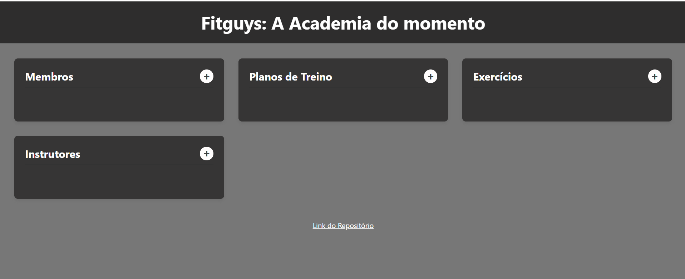
*Essa é a tela principal*

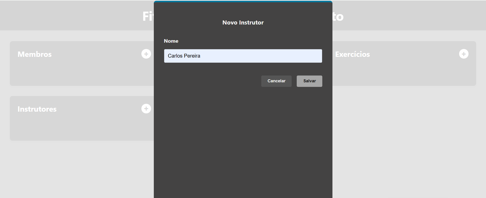
*Aqui estamos adicionando um Intrutor*

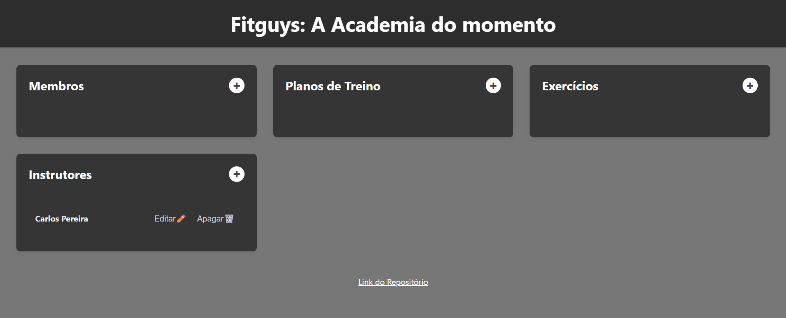
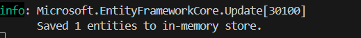
*O instrutor foi adicionado*

*Agora vamos adicionar um plano*

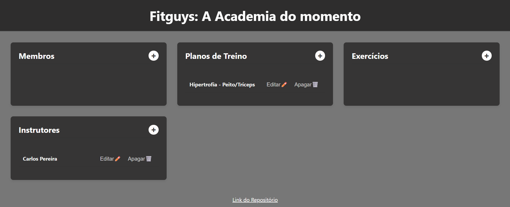
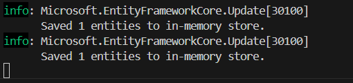
*Plano adicionado*

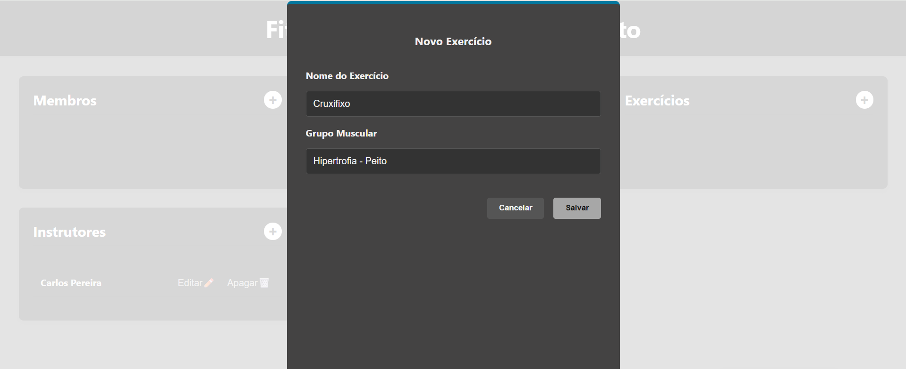
*Agora vamos adicionar um exercicio*

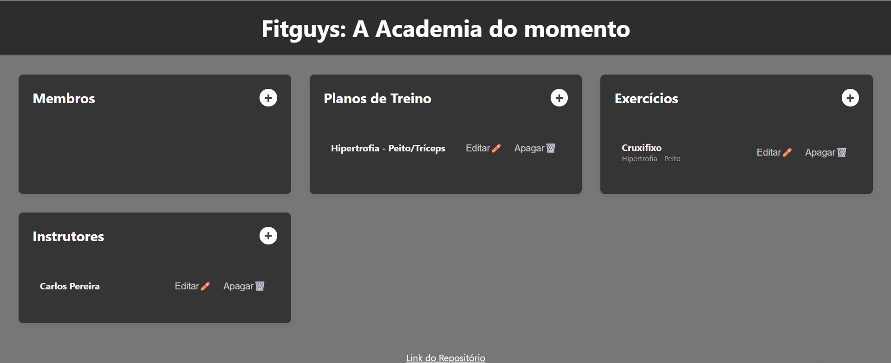
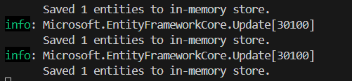
*Exercicio adicionado*

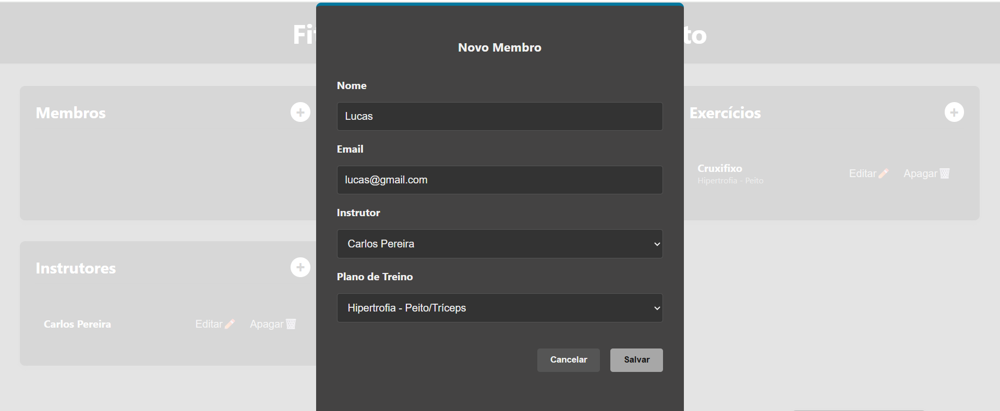
*Agora vamos adicionar um membro*

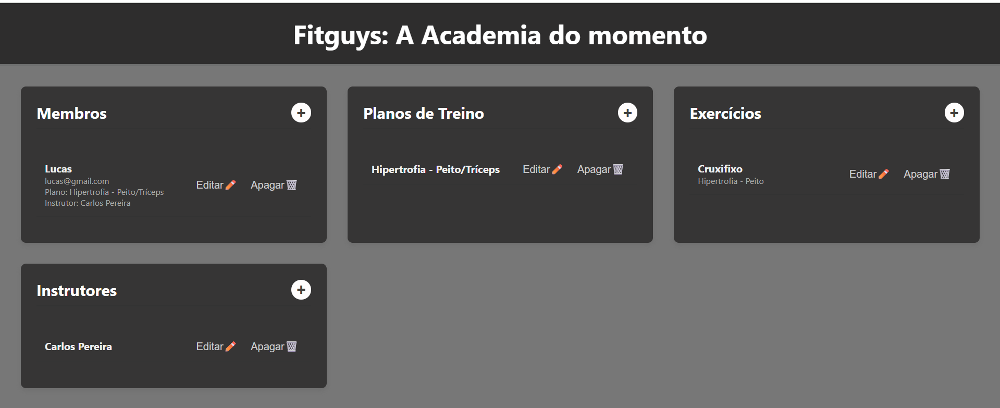

*Membro adicionado*

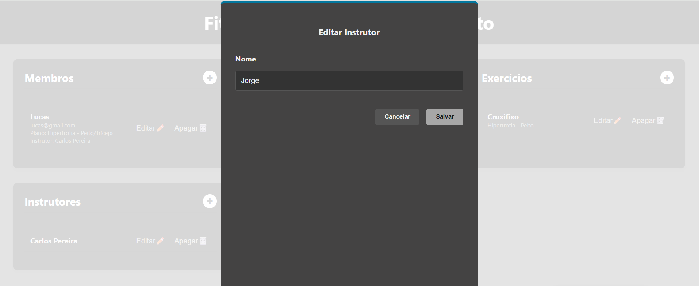
*Agora vamos editar o instrutor*

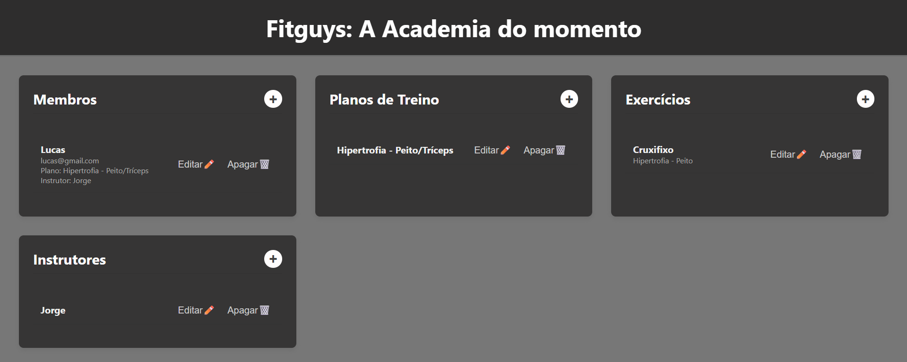

*Instrutor editado*

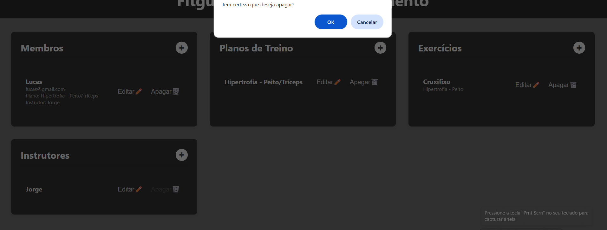
*Agora vamos apagar o instrutor*

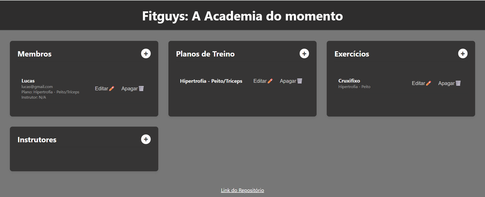

*instrutor apagado*

